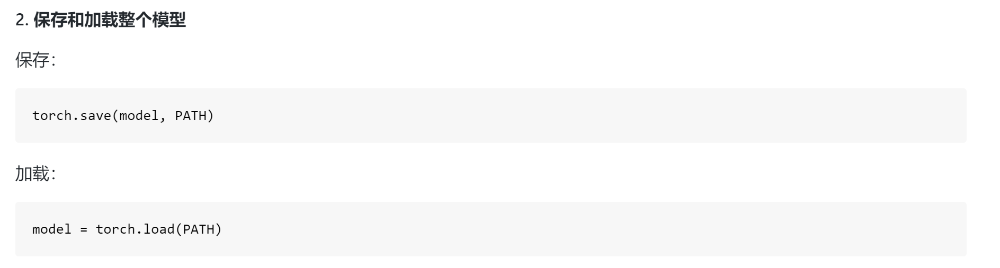

<!--
 * @Author: Charlie
 * @Date: 2020-05-30 14:34:14
 * @LastEditTime: 2020-06-05 18:07:34
 * @LastEditors: Peng Tianhao
 * @Description: 学习笔记
 * @FilePath: \Dive-into-DL-PyTorch\README.md
 * @No Bugs Here!👇
--> 
# 进度

**#2020年5月30日14点34分**

看完了 docs/3.1

**#2020年5月30日16点13分**

看完了 docs/3.3

**#2020年5月30日17点01分**

看完了 docs/3.5

**#2020年5月30日22点27分**

看完了 docs/3.7

**#2020年5月31日11点48分**

看完了 docs/3.13

**#2020年6月1日17点40分**

看完了 docs/3.16

**#2020年6月1日21点53分**

看完了 docs/4.2

**#2020年6月2日15点07分**

看完了 docs/4.6

**#2020年6月2日17点46分**

看完了 docs/5.5

**#2020年6月4日18点04分**

看完了 docs/5.12

**#2020年6月5日18点07分**

看完了 docs/6.6

# 笔记

### 1. dropout

通常的建议是把靠近输入层的丢弃概率设得小一点。在这个实验中，我们把第一个隐藏层的丢弃概率设为0.2，把第二个隐藏层的丢弃概率设为0.5。

### 2. 构建模型结构

### 3. Dict & OrderDict

OrderDict可以用来构建module:

### 4. 搭建自定义的网络模块

见docs/4.4

### 5. 保存 & 加载模型

### 6. 查看CUDA相关参数的命令

### 7. pooling layer 的作用

### 8. 困惑度-评价模型的指标

### 9. RNN底层代码/原理实现

见docs/ 6.4 

### 10. RNN loss计算图

# 疑问

1. docs/ 6.2 

