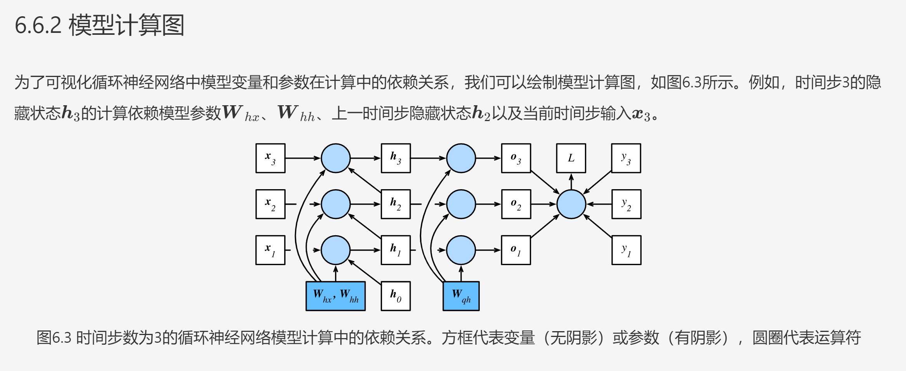

<!--
 * @Author: Peng Tianhao
 * @Date: 2020-05-30 14:34:14
 * @LastEditTime: 2020-06-10 16:53:05
 * @LastEditors: Peng Tianhao
 * @Description: 学习笔记
 * @FilePath: \Dive-into-DL-PyTorch\README.md
 * @No Bugs Here!👇
--> 
# 进度

**#2020年5月30日14点34分**

看完了 docs/3.1

**#2020年5月30日16点13分**

看完了 docs/3.3

**#2020年5月30日17点01分**

看完了 docs/3.5

**#2020年5月30日22点27分**

看完了 docs/3.7

**#2020年5月31日11点48分**

看完了 docs/3.13

**#2020年6月1日17点40分**

看完了 docs/3.16

**#2020年6月1日21点53分**

看完了 docs/4.2

**#2020年6月2日15点07分**

看完了 docs/4.6

**#2020年6月2日17点46分**

看完了 docs/5.5

**#2020年6月4日18点04分**

看完了 docs/5.12

**#2020年6月5日18点07分**

看完了 docs/6.6

**#2020年6月5日22点27分**

看完了 docs/6.10

**#2020年6月7日16点31分**

看完了 docs/7.8

**#2020年6月7日16点39分**

看完了 docs/8.4

**#2020年6月7日16点40分**

跳过了 docs/9.1 - 9.11

**#2020年6月8日18点51分**

看完了 docs/10.4

**#2020年6月10日16点52分**

粗略看完了 docs/10.5-10.11

# 笔记

### 1. dropout

通常的建议是把靠近输入层的丢弃概率设得小一点。在这个实验中，我们把第一个隐藏层的丢弃概率设为0.2，把第二个隐藏层的丢弃概率设为0.5。

### 2. 构建模型结构

### 3. Dict & OrderDict

OrderDict可以用来构建module:

### 4. 搭建自定义的网络模块

见docs/4.4

### 5. 保存 & 加载模型

### 6. 查看CUDA相关参数的命令

### 7. pooling layer 的作用

### 8. 困惑度-评价模型的指标

### 9. RNN底层代码/原理实现

见docs/ 6.4 

### 10. RNN loss计算图

### 11. GRU门结构

我们对门控循环单元的设计稍作总结：

- 重置门有助于捕捉时间序列里短期的依赖关系；

- 更新门有助于捕捉时间序列里长期的依赖关系。

### 12. LSTM 单元结构

### 13. 使用多GPUs进行模型训练

见 docs/8.4

### 13. Negative Sampling 负采样

采用负采样后：训练中每一步的梯度计算开销不再与词典大小相关，而与K线性相关。当K取较小的常数时，负采样在每一步的梯度计算开销较小

### 14. fastText 子词嵌入

将一个词拆分开来，得到该单词的子词集合。与跳字模型相比，fastText中词典规模更大，造成模型参数更多，同时一个词的向量需要对所有子词向量求和，继而导致计算复杂度更高。但与此同时，较生僻的复杂单词，甚至是词典中没有的单词，可能会从同它结构类似的其他词那里获取更好的词向量表示。

fastText提出了子词嵌入方法。它在word2vec中的跳字模型的基础上，将中心词向量表示成单词的子词向量之和。

子词嵌入利用构词上的规律，通常可以提升生僻词表示的质量。

# 疑问

1. docs/ 6.2 

